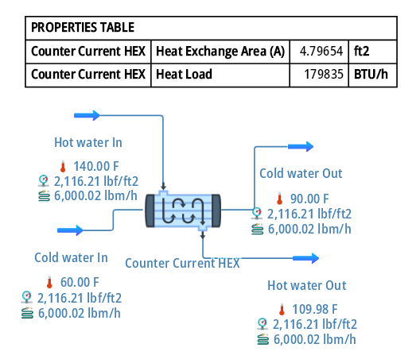
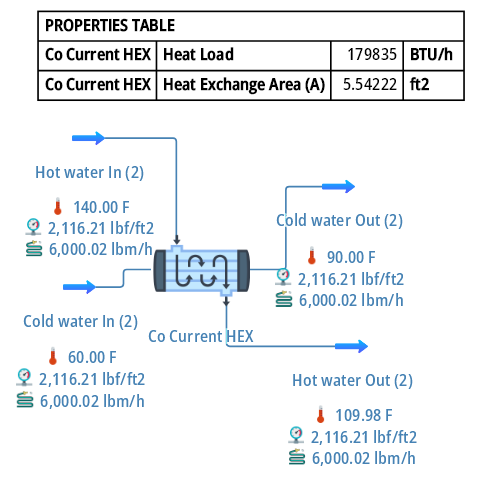

## Double Pipe Heat Exchanger Modelling in DWSim

## Objective

Two variations of the design of heat exchanger have been proposed. The unit is cool hot-water stream from 140 °F to 110 °F through indirect contact with a cold-water stream that is being Heated from 60 °F to 90 °F. The water flow rate is 100 lb/min and the overall heat transfer coefficient may be assumed equal to 750 Btu/h ft2 °F. Calculate the area requirements for the following two exchanger conditions:

1.	double pipe co-current flow
2.	double pipe counter-current flow

## Data

Hot water In: Flow rate 100 lb/min, Temp 140 °F

Cold water In: Flow rate 100 lb/min, Temp 60 °F

Overall HTC Assumed = 750 Btu/h ft2 °F.

Hot water Out: Temp 110 °F

Cold water Out: Temp 90 °F

## DWSIM Blocks Used

Material Stream

HEX 

## Thermodynamic Package

Steam Tables (IAPWS-IF97)

## Flowsheet

