**Objective**

To make a Dynamic Simulation Simulation for an Non Interacting Tanks System

**DWSIM Blocks used :**

 1. Tanks 
 2. Material Streams 
 3. Control Valves 
 4. Level Gauges 
 5. PID Controllers
 
**Procedure:**

1. Build your model as in the following picture:

2. Enable/Activate Dynamic Mode.
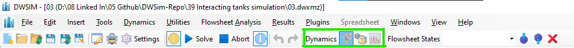

3. Set the inlet stream Pressure to 1.5 bar and Mass Flow to 36000 kg/h. Set its Dynamic Spec to 'Flow'.
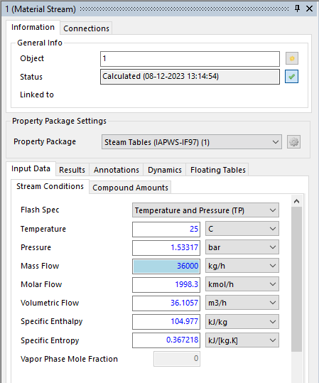
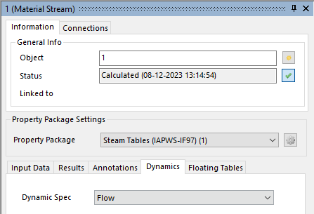

4. Set VALVE-1 calculation type to Liquid Kv, Kvmax to 100, check the Opening vs Kv/Kvmax box and set the valve opening to 50%.
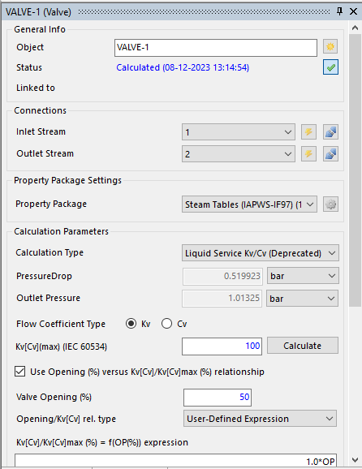

5. Set TANKS-1 & TANKS-2 volume to 2 m3 and available liquid height to 2 m. Set the "Reset Content" property to 1.
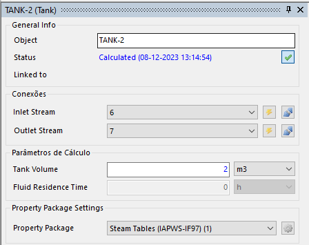
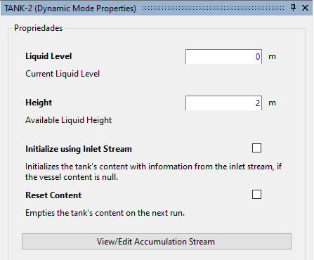

6. Set VALVE-2 % VALVE-3 calculation type to Liquid Kv, Kvmax to 400, check the Opening vs Kv/Kvmax box and set the valve opening to 50%.

7. Set the outlet stream Pressure to 101325 Pa. Set its Dynamic Spec to Pressure.
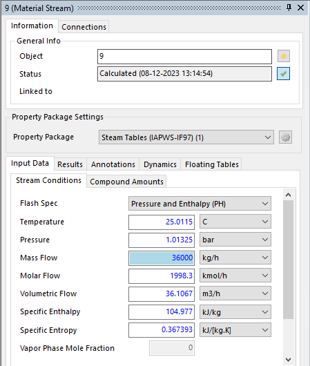

8. Add a Level Gauge and associate it with the Tank’s Liquid Level property. Set its maximum value to 1 m.
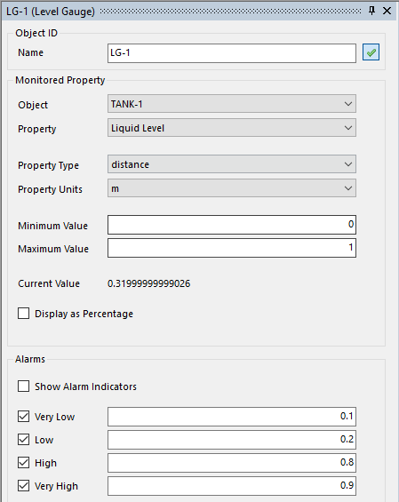

9. Save the current flowsheet state as "1". (This is optional)

10. Go to the Dynamics Manager and create a new Integrator (1) with Integration Step equal to 5 seconds and Duration equal to 20 minutes. Add the Tank’s liquid level and the openings of the three valves as monitored variables for this integrator.
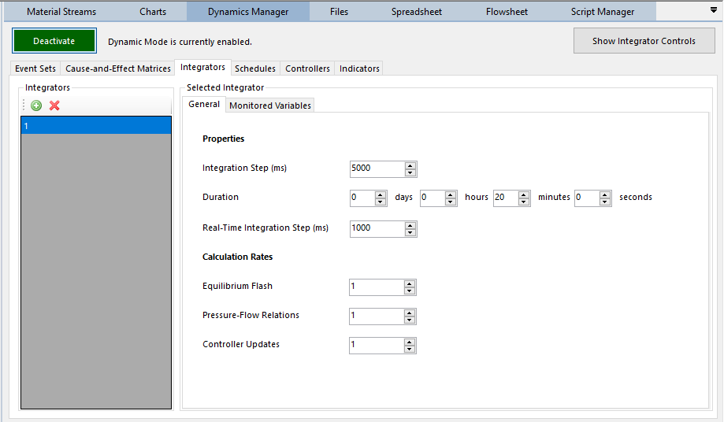
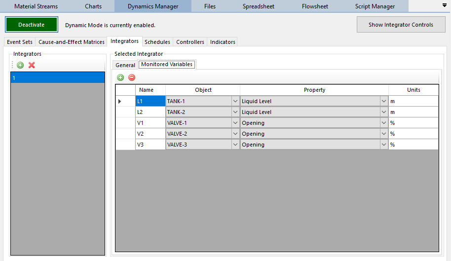

11. Create a new Schedule (1) and associate the previously created Integrator and Flowsheet State with it.
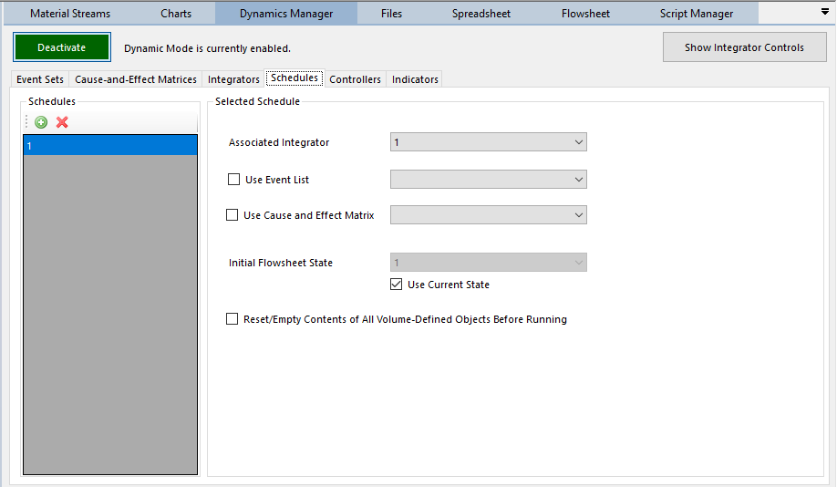

12. Open the Integrator Controls Panel and run the dynamic simulation.
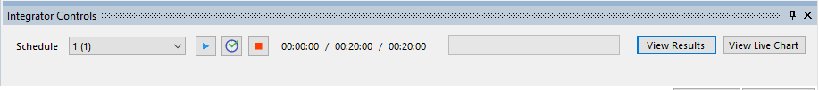

13. On the Integrator Controls Panel, click on the View Results button.

***For PID Controller's tuning and guide pls refer to DWSim User Manual***